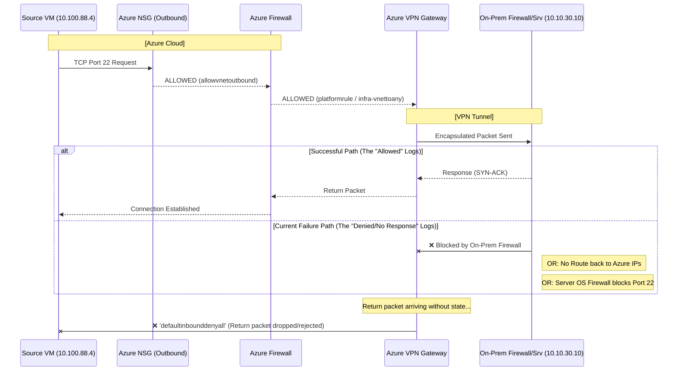

```kql
NTANetAnalytics
| where FlowStartTime > ago(30m)
| where (SrcIp == "10.100.88.4" and DestIp == "10.10.30.10") 
| project TimeGenerated, FlowDirection, FlowStatus, AclRule, SrcIp, DestIp
```
| TimeGenerated                | FlowDirection | FlowStatus | AclRule               | SrcIp       | DestIp      |
| ---------------------------- | ------------- | ---------- | --------------------- | ----------- | ----------- |
| 2026-10-08T11:52:42.2123106Z | Inbound       | Allowed    | platformrule          | 10.100.88.4 | 10.10.30.10 |
| 2026-10-08T11:52:42.2123106Z | Outbound      | Allowed    | allowvnetoutbound     | 10.100.88.4 | 10.10.30.10 |
| 2026-10-08T11:52:39.2947074Z | Inbound       | Allowed    | infra-vnettoany       | 10.100.88.4 | 10.10.30.10 |
| 2026-10-08T11:52:39.6965342Z | Inbound       | Allowed    | platformrule          | 10.100.88.4 | 10.10.30.10 |
| 2026-10-08T11:52:40.3326676Z | Inbound       | Denied     | defaultinbounddenyall | 10.100.88.4 | 10.10.30.10 |
| 2026-10-08T11:52:40.2187792Z | Inbound       | Allowed    | infra-vnettoany       | 10.100.88.4 | 10.10.30.10 |

