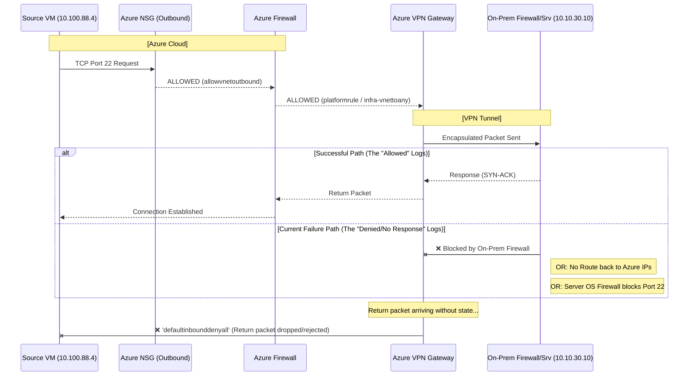

```kql
NTANetAnalytics
| where FlowStartTime > ago(30m)
//| where TimeGenerated between (datetime(2026-10-08T11:50:03) .. datetime(2026-10-08T11:53:03))
| where (SrcIp == "10.100.88.4" and DestIp == "10.10.30.10") 
| project TimeGenerated, FlowDirection, FlowStatus, AclRule, SrcIp, DestIp
```
### Results
| TimeGenerated                | FlowDirection | FlowStatus | AclRule               | SrcIp       | DestIp      |
| ---------------------------- | ------------- | ---------- | --------------------- | ----------- | ----------- |
| 2026-10-08T11:52:42.2123106Z | Inbound       | Allowed    | platformrule          | 10.100.88.4 | 10.10.30.10 |
| 2026-10-08T11:52:42.2123106Z | Outbound      | Allowed    | allowvnetoutbound     | 10.100.88.4 | 10.10.30.10 |
| 2026-10-08T11:52:39.2947074Z | Inbound       | Allowed    | infra-vnettoany       | 10.100.88.4 | 10.10.30.10 |
| 2026-10-08T11:52:39.6965342Z | Inbound       | Allowed    | platformrule          | 10.100.88.4 | 10.10.30.10 |
| 2026-10-08T11:52:40.3326676Z | Inbound       | Denied     | defaultinbounddenyall | 10.100.88.4 | 10.10.30.10 |
| 2026-10-08T11:52:40.2187792Z | Inbound       | Allowed    | infra-vnettoany       | 10.100.88.4 | 10.10.30.10 |
### Definitions
| ACL Rule                    | Source         | Meaning                                                     | Result  |
| :-------------------------- | :------------- | :---------------------------------------------------------- | :------ |
| **`infra-vnettoany`**       | Azure Firewall | "Traffic from infra subnet is allowed to go out."           | ✅ PASS  |
| **`platformrule`**          | Azure Firewall | "Traffic matches the allowed platform security policy."     | ✅ PASS  |
| **`allowvnetoutbound`**     | NSG (Outbound) | "The VM is allowed to send this packet to the destination." | ✅ PASS  |
| **`defaultinbounddenyall`** | NSG (Inbound)  | "No rule exists to allow this specific incoming packet."    | ❌ BLOCK |
```kql
AZFWNetworkRule
| where SourceIp == "10.100.88.4" and DestinationIp == "10.10.30.10"
| where  Protocol startswith "ICMP"
| project TimeGenerated, SourceIp, DestinationIp, DestinationPort ,Protocol, Action, RuleCollection
 ```
### Results
| TimeGenerated               | SourceIp    | DestinationIp | DestinationPort | Protocol    | Action | RuleCollection |
| --------------------------- | ----------- | ------------- | --------------- | ----------- | ------ | -------------- |
| 2026-10-08T11:58:33.206597Z | 10.100.88.4 | 10.10.30.10   | 0               | ICMP Type=8 | Allow  | infra-network  |
| 2026-10-08T12:17:36.881827Z | 10.100.88.4 | 10.10.30.10   | 0               | ICMP Type=8 | Allow  | infra-network  |
```kql
AZFWNetworkRule
| where SourceIp == "10.100.88.4" and DestinationIp == "10.10.30.10"
| where  DestinationPort == 22
| project TimeGenerated, SourceIp, DestinationIp, DestinationPort ,Protocol, Action, RuleCollection
 ```
### Results
| TimeGenerated               | SourceIp    | DestinationIp | DestinationPort | Protocol | Action | RuleCollection |
| --------------------------- | ----------- | ------------- | --------------- | -------- | ------ | -------------- |
| 2026-10-08T11:23:18.770632Z | 10.100.88.4 | 10.10.30.10   | 22              | TCP      | Allow  | infra-network  |
| 2026-10-08T11:23:19.77064Z  | 10.100.88.4 | 10.10.30.10   | 22              | TCP      | Allow  | infra-network  |


